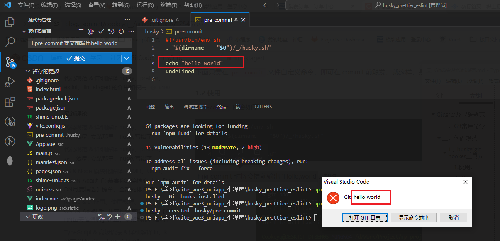

# Git命令及代码规范

## 一、Git常用命令


## 二、代码规范

> 参考链接:
>
> https://blog.csdn.net/cookcyq__/article/details/125457031
>
> https://blog.csdn.net/picktheshy/article/details/130769724


### 1、husky(git hookes工具)：

#### 	1.安装：

```js
1. git init //初始化git仓库
2. npm install husky --save-dev  //安装hustky
3. npx husky install  //初始化hustky(即自动添加相关文件目录)
4. npx husky add .husky/pre-commit  //添加pre-commit钩子文件（即代码git提交前进行检查）
```

#### 	2.使用：

​		`pre-commit`中添加如下，会在commit 提交前输出 ‘Hello,world’

```js
#!/usr/bin/env sh
. "$(dirname -- "$0")/_/husky.sh"

echo "Hello,world"
例：
pnpm run format  则是在提交前执行该脚本命令
```

​	注意：此处默认的undefined限制了提交




### 2、eslint配置

> **eslint中文官网:http://eslint.cn/**

#### 	1.安装

```js
1. pnpm i eslint -D  //安装依赖
2. npx eslint --init //初始化eslint,根据需要选中并生成配置文件.eslint.cjs
//安装完成后.eslintrc.js中配置具体规则，详细规则可参考官方文档
此外：.eslintignore文件可以设置eslint检查忽略文件
```

#### 	2.其他插件

```js
'vue3环境代码校验插件'

# 让所有与prettier规则存在冲突的Eslint rules失效，并使用prettier进行代码检查
"eslint-config-prettier": "^8.6.0",
"eslint-plugin-import": "^2.27.5",
"eslint-plugin-node": "^11.1.0",
# 运行更漂亮的Eslint，使prettier规则优先级更高，Eslint优先级低
"eslint-plugin-prettier": "^4.2.1",
# vue.js的Eslint插件（查找vue语法错误，发现错误指令，查找违规风格指南
"eslint-plugin-vue": "^9.9.0",
# 该解析器允许使用Eslint校验所有babel code
"@babel/eslint-parser": "^7.19.1",

```

插件安装指令：

```js
pnpm install -D eslint-plugin-import eslint-plugin-vue eslint-plugin-node eslint-plugin-prettier eslint-config-prettier eslint-plugin-node @babel/eslint-parser
```

*详细规则配置可参考官方文档或https://blog.csdn.net/picktheshy/article/details/130769724*


####  3.运行脚本：

package.json新增两个运行脚本:

```js
"scripts": {
    "lint": "eslint src",
    "fix": "eslint src --fix",
}
```


### 3、prettier配置

> eslint主要针对js语法规范，prettier主要针对格式规范

####  1.安装

```js
pnpm install -D eslint-plugin-prettier prettier eslint-config-prettier
```

####  2.配置

*参考：https://blog.csdn.net/weixin_63228975/article/details/131213411*

```js
{
  "printWidth": 100,	//每行最多显示的字符数
  "tabWidth": 2,//tab的宽度 2个字符
  "useTabs": false,//禁止使用tab代替空格
  "semi": true,//结尾使用分号
  "singleQuote": true,//使用单引号代替双引号
  "trailingComma": "none",//结尾是否添加逗号
  "bracketSpacing": true,//对象括号俩边是否用空格隔开
  "bracketSameLine": true,;//组件最后的尖括号不另起一行
  "arrowParens": "always",//箭头函数参数始终添加括号
  "htmlWhitespaceSensitivity": "ignore",//html存在空格是不敏感的
  "vueIndentScriptAndStyle": false,//vue 的script和style的内容是否缩进
  "endOfLine": "auto",//行结尾形式 mac和linux是\n  windows是\r\n 
  "singleAttributePerLine": false //组件或者标签的属性是否控制一行只显示一个属性
}

```


### 4、stylelint配置

> [stylelint](https://stylelint.io/)为css的lint工具。可格式化css代码，检查css语法错误与不合理的写法，指定css书写顺序等。

####  1.安装

* 我们的项目中使用scss作为预处理器，安装以下依赖：*

```js
pnpm add sass sass-loader stylelint postcss postcss-scss postcss-html stylelint-config-prettier stylelint-config-recess-order stylelint-config-recommended-scss stylelint-config-standard stylelint-config-standard-vue stylelint-scss stylelint-order stylelint-config-standard-scss -D
```

####  2.配置

> 官网：**https://stylelint.bootcss.com/**

- 相关配置示例：

```js
// @see https://stylelint.bootcss.com/

module.exports = {
  extends: [
    'stylelint-config-standard', // 配置stylelint拓展插件
    'stylelint-config-html/vue', // 配置 vue 中 template 样式格式化
    'stylelint-config-standard-scss', // 配置stylelint scss插件
    'stylelint-config-recommended-vue/scss', // 配置 vue 中 scss 样式格式化
    'stylelint-config-recess-order', // 配置stylelint css属性书写顺序插件,
    'stylelint-config-prettier', // 配置stylelint和prettier兼容
  ],
  overrides: [
    {
      files: ['**/*.(scss|css|vue|html)'],
      customSyntax: 'postcss-scss',
    },
    {
      files: ['**/*.(html|vue)'],
      customSyntax: 'postcss-html',
    },
  ],
  ignoreFiles: [
    '**/*.js',
    '**/*.jsx',
    '**/*.tsx',
    '**/*.ts',
    '**/*.json',
    '**/*.md',
    '**/*.yaml',
  ],
  /**
   * null  => 关闭该规则
   * always => 必须
   */
  rules: {
    'value-keyword-case': null, // 在 css 中使用 v-bind，不报错
    'no-descending-specificity': null, // 禁止在具有较高优先级的选择器后出现被其覆盖的较低优先级的选择器
    'function-url-quotes': 'always', // 要求或禁止 URL 的引号 "always(必须加上引号)"|"never(没有引号)"
    'no-empty-source': null, // 关闭禁止空源码
    'selector-class-pattern': null, // 关闭强制选择器类名的格式
    'property-no-unknown': null, // 禁止未知的属性(true 为不允许)
    'block-opening-brace-space-before': 'always', //大括号之前必须有一个空格或不能有空白符
    'value-no-vendor-prefix': null, // 关闭 属性值前缀 --webkit-box
    'property-no-vendor-prefix': null, // 关闭 属性前缀 -webkit-mask
    'selector-pseudo-class-no-unknown': [
      // 不允许未知的选择器
      true,
      {
        ignorePseudoClasses: ['global', 'v-deep', 'deep'], // 忽略属性，修改element默认样式的时候能使用到
      },
    ],
  },
}

```

- stylelintignore忽略文件

```JS
/node_modules/*
/dist/*
/html/*
/public/*
```

- 运行脚本

```js
"scripts": {
	"lint:style": "stylelint src/**/*.{css,scss,vue} --cache --fix"
}
```

- 配置统一的prettier来格式化我们的js和css，html代码（运行`pnpm run format`的时候，会把代码直接格式化）

```js
 "scripts": {
    "dev": "vite --open",
    "build": "vue-tsc && vite build",
    "preview": "vite preview",
    "lint": "eslint src",
    "fix": "eslint src --fix",
    "format": "prettier --write \"./**/*.{html,vue,ts,js,json,md}\"",
    "lint:eslint": "eslint src/**/*.{ts,vue} --cache --fix",
    "lint:style": "stylelint src/**/*.{css,scss,vue} --cache --fix"
  },
```

### 5、commitlint配置

> git提交commit信息规范

####  1.安装

```js
pnpm add @commitlint/config-conventional @commitlint/cli -D
```

####  2.配置

- 添加配置文件，新建`commitlint.config.cjs`(注意是cjs)，然后添加下面的代码：

```js
module.exports = {
  extends: ['@commitlint/config-conventional'],
  // 校验规则
  rules: {
    'type-enum': [
      2,
      'always',
      [
        'feat',
        'fix',
        'docs',
        'style',
        'refactor',
        'perf',
        'test',
        'chore',
        'revert',
        'build',
      ],
    ],
    'type-case': [0],
    'type-empty': [0],
    'scope-empty': [0],
    'scope-case': [0],
    'subject-full-stop': [0, 'never'],
    'subject-case': [0, 'never'],
    'header-max-length': [0, 'always', 72],
  },
}
```

- 在`package.json`中配置scripts命令

```js
# 在scrips中添加下面的代码
{
"scripts": {
    "commitlint": "commitlint --config commitlint.config.cjs -e -V"
  },
}
```

- 配置结束，现在当我们填写`commit`信息的时候，前面就需要带着下面的`subject`

```js
'feat',//新特性、新功能
'fix',//修改bug
'docs',//文档修改
'style',//代码格式修改, 注意不是 css 修改
'refactor',//代码重构
'perf',//优化相关，比如提升性能、体验
'test',//测试用例修改
'chore',//其他修改, 比如改变构建流程、或者增加依赖库、工具等
'revert',//回滚到上一个版本
'build',//编译相关的修改，例如发布版本、对项目构建或者依赖的改动
```

- 配置husky

```js
npx husky add .husky/commit-msg 
```

- 在生成的commit-msg文件中添加下面的命令

```js
#!/usr/bin/env sh
. "$(dirname -- "$0")/_/husky.sh"
pnpm commitlint
```

####  3.注意

```js
当我们 commit 提交信息时，就不能再随意写了
必须是 git commit -m ‘fix: xxx’ 符合类型的才可以

'需要注意的是类型的后面需要用英文的 :
'并且冒号后面是需要空一格的，这个是不能省略的
```

### 6、lint-staged配置

> `lint-staged` 能让这些插件只扫描暂存区的文件而不是全盘扫描,只检查&修复我们修改过的文件

####  1.安装

```js
npm i lint-staged -D
```

####  2.配置

- 在 `package.json` 新增 `lint-staged` 选项

```js
  "scripts": {
    ...
  },
  "lint-staged": {
    "src/**/*.{js,jsx,ts,tsx,json,css,scss,md}": [
      "eslint --fix"
    ]
  },
```

- 在 `pro-commit` 新增命令

~~~js
```sh
#!/usr/bin/env sh
. "$(dirname -- "$0")/_/husky.sh"
# 注释
# npm run prettier:check && git add -A .
# 注释
# npm run eslint:check
# 新增
npx lint-staged
~~~


### 7、强制使用pnpm包管理器工具

> 团队开发项目的时候，需要统一包管理器工具,因为不同包管理器工具下载同一个依赖,可能版本不一样,
>
> 导致项目出现bug问题,因此包管理器工具需要统一管理！！！

在根目录创建scritps/preinstall.js文件，添加下面的内容

```js
if (!/pnpm/.test(process.env.npm_execpath || '')) {
  console.warn(
    `\u001b[33mThis repository must using pnpm as the package manager ` +
    ` for scripts to work properly.\u001b[39m\n`,
  )
  process.exit(1)
}
```

- 配置命令

```js
"scripts": {
	"preinstall": "node ./scripts/preinstall.js"
}
```

*此时：当我们使用npm或者yarn来安装包的时候，就会报错了。原理就是在install的时候会触发preinstall（npm提供的生命周期钩子）这个文件里面的代码。*

## 三、其他

### 1、git忽略文件相关规则配置

> 参考链接：https://blog.csdn.net/weixin_44029226/article/details/128812624

```js
1.以”#”号开头表示注释；

2.以斜杠“/”开头表示目录；

3.以星号“*”通配多个字符；

4.以问号“?”通配单个字符

5.以方括号“[]”包含单个字符的匹配列表；

6.以叹号“!”表示不忽略(跟踪)匹配到的文件或目录；

7.此外，git 对于 .ignore 配置文件是按行从上到下进行规则匹配的，意味着如果前面的规则匹配的范围更大，则后面的规则将不会生效；
```


### 2、代码提交规范

```js
'feat',//新特性、新功能
'fix',//修改bug
'docs',//文档修改
'style',//代码格式修改, 注意不是 css 修改
'refactor',//代码重构
'perf',//优化相关，比如提升性能、体验
'test',//测试用例修改
'chore',//其他修改, 比如改变构建流程、或者增加依赖库、工具等
'revert',//回滚到上一个版本
'build',//编译相关的修改，例如发布版本、对项目构建或者依赖的改动
```

